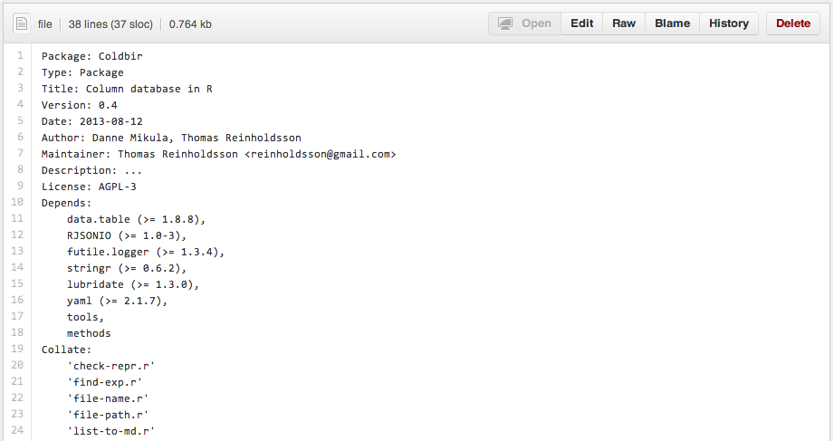
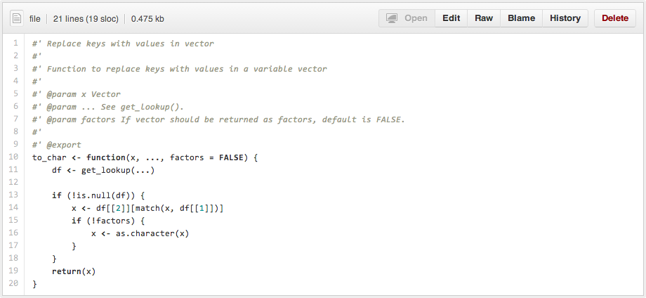

## Building your own package in R

- Why!?
- Package structure
- Package documentation
- Build packages with RStudio
- (Workshop)

---

## Why!?

It's a great way to distribute and make code **re-usable**, not only for you, but also for others.

### Where to publish?

- The Comprehensive R Archive Network (CRAN)
  - `install.packages("Package")`
- R-Forge
  - `install.packages("Package", repos="http://R-Forge.R-project.org")`
- GitHub
  - `devtools::install_github("Package", "User")`
- Bitbucket
  - `devtools::install_bitbucket("Package", "User")`

---

## Package structure

The example is taken from the `Coldbir` package.

---

### Essential components

    R/

directory with all R code

    DESCRIPTION
    
description file

    man/
    
directory with package documentation generated with `roxygen2`

    NAMESPACE
    
defines what functions are available to others to use, generated with `roxygen2`

---

### `DESCRIPTION` file

---

## Documentation

Use `roxygen2` to automatically generate `.Rd` files in the `man` directory

The documentation is then available by calling the help function; `?to_char`.

---

## Build package

<iframe src = 'http://ltcstats.perriard.se/rstudio/' height='600px'></iframe>

---

## Build package

One could also use `package.skeleton()` or `devtools::create()` to generate the initial package structure.

In addition, for writing tests look at package `testthat` and for work flow automatization use `makefiles` (not a package).

---

## See also

### Useful links

- [Creating R Packages: A Tutorial, by Friedrich Leisch](http://portal.stats.ox.ac.uk/userdata/ruth/APTS2012/Rcourse10.pdf)
- [Developing Packages with RStudio](http://www.rstudio.com/ide/docs/packages/overview)
- [Package basics, by Hadley Wickham](http://adv-r.had.co.nz/Package-basics.html)

### Examples
- [`Coldbir`](https://github.com/SwedishPensionsAgency/Coldbir)
- [`slidify`](https://github.com/ramnathv/rCharts)

---

## Thanks, please try it out!
